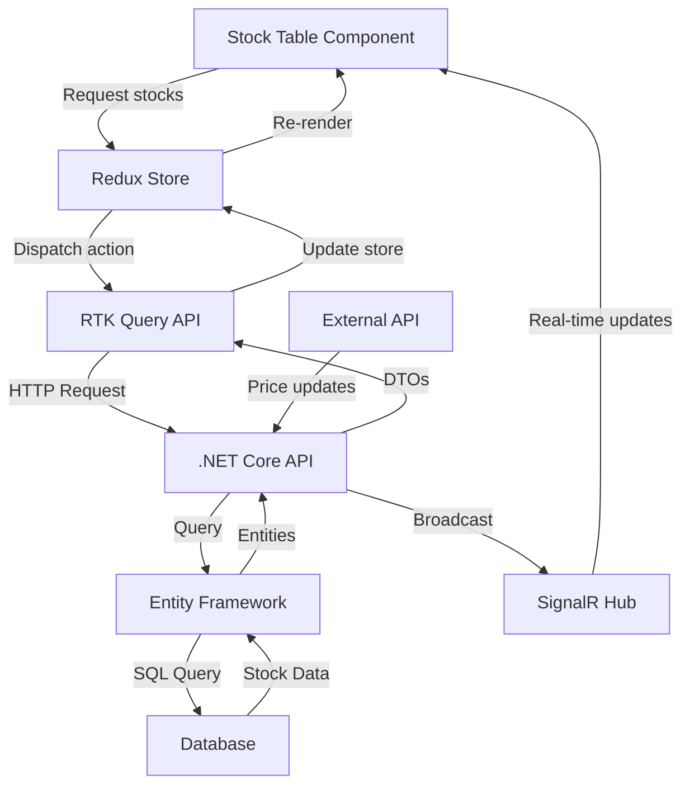
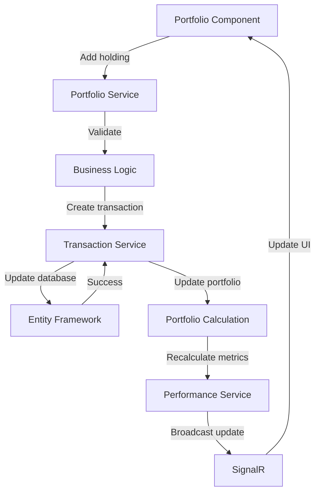
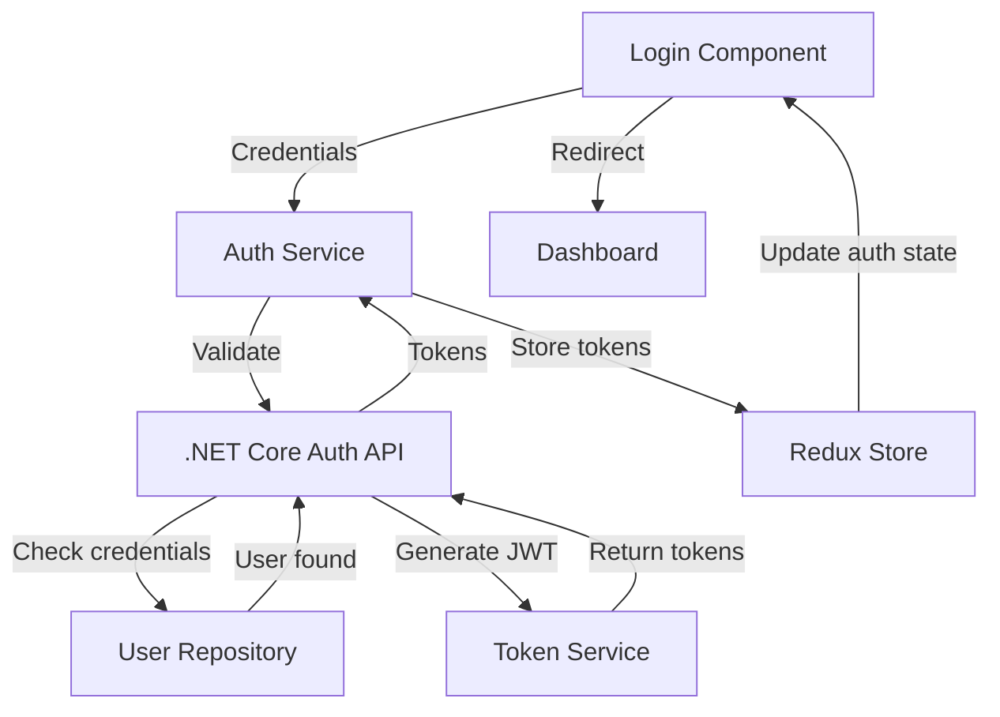

# Investment Planning Application Design

## Overview

The Investment Planning Application is a full-stack web application designed to help users plan and track their investment portfolios. The application features a React frontend for user interaction and a .NET Core backend for data management and business logic. The core functionality centers around a comprehensive stock table that allows users to monitor, analyze, and manage their investment holdings.

### Key Features
- User authentication and portfolio management
- Real-time stock data integration
- Interactive stock table with filtering and sorting
- Investment portfolio tracking and analysis
- Performance metrics and reporting
- Investment planning tools and recommendations

### Technology Stack
- **Frontend**: React 18+ with TypeScript
- **Backend**: .NET Core 6/7 Web API
- **Database**: SQL Server or PostgreSQL
- **Authentication**: JWT with refresh tokens
- **Real-time Updates**: SignalR for live stock prices
- **External APIs**: Financial data providers (Alpha Vantage, Yahoo Finance, or similar)

## Frontend Architecture

### Component Architecture

#### Component Hierarchy
```
App
├── Layout
│   ├── Header
│   │   ├── NavigationMenu
│   │   ├── UserProfile
│   │   └── NotificationCenter
│   ├── Sidebar
│   │   ├── PortfolioSummary
│   │   └── QuickActions
│   └── Footer
├── Pages
│   ├── Dashboard
│   │   ├── PortfolioOverview
│   │   ├── MarketSummary
│   │   └── RecentTransactions
│   ├── StockTable
│   │   ├── StockTableHeader
│   │   ├── StockTableFilters
│   │   ├── StockTableBody
│   │   │   ├── StockRow
│   │   │   └── StockActions
│   │   └── StockTablePagination
│   ├── Portfolio
│   │   ├── PortfolioChart
│   │   ├── AssetAllocation
│   │   └── PerformanceMetrics
│   ├── Planning
│   │   ├── InvestmentGoals
│   │   ├── RiskAssessment
│   │   └── RecommendationEngine
│   └── Authentication
│       ├── LoginForm
│       ├── RegisterForm
│       └── ForgotPassword
└── Shared
    ├── UI Components
    │   ├── Button
    │   ├── Input
    │   ├── Modal
    │   ├── Table
    │   └── Chart
    └── Hooks
        ├── useAuth
        ├── useStockData
        └── usePortfolio
```

#### Core Components

**StockTable Component**
- **Props**: 
  - `stocks: Stock[]`
  - `onSort: (column: string, direction: 'asc' | 'desc') => void`
  - `onFilter: (filters: StockFilters) => void`
  - `onRowSelect: (stockId: string) => void`
- **State**: 
  - `selectedStocks: string[]`
  - `sortConfig: SortConfig`
  - `filterConfig: FilterConfig`
- **Features**: 
  - Real-time price updates
  - Multi-column sorting
  - Advanced filtering (by sector, market cap, price range)
  - Row selection for bulk actions
  - Virtualization for large datasets

**StockRow Component**
- **Props**: 
  - `stock: Stock`
  - `isSelected: boolean`
  - `onSelect: (stockId: string) => void`
- **State**: 
  - `priceChange: PriceChange`
  - `isLoading: boolean`
- **Features**: 
  - Color-coded price changes
  - Hover actions (quick buy/sell)
  - Expandable details

### State Management

**Redux Toolkit Structure**
```
store/
├── slices/
│   ├── authSlice.ts
│   ├── stocksSlice.ts
│   ├── portfolioSlice.ts
│   ├── planningSlice.ts
│   └── uiSlice.ts
├── api/
│   ├── authApi.ts
│   ├── stocksApi.ts
│   ├── portfolioApi.ts
│   └── planningApi.ts
└── index.ts
```

**Key State Objects**
- `auth`: User authentication state, tokens, permissions
- `stocks`: Stock data, real-time prices, market information
- `portfolio`: User holdings, transactions, performance data
- `planning`: Investment goals, risk profile, recommendations
- `ui`: Loading states, notifications, modal states

### Routing & Navigation

**Route Structure**
```
/dashboard - Main dashboard with portfolio overview
/stocks - Stock table and market data
/portfolio - Detailed portfolio view and analytics
/planning - Investment planning tools
/transactions - Transaction history and management
/settings - User preferences and account settings
/auth/login - User authentication
/auth/register - User registration
```

### API Integration Layer

**API Client Configuration**
- Axios interceptors for authentication
- Automatic retry logic for failed requests
- Request/response transformation
- Error handling and user notifications

**Real-time Data Integration**
- SignalR connection for live stock prices
- WebSocket fallback for compatibility
- Automatic reconnection logic
- Efficient data updates using React.memo and useMemo

## Backend Architecture

### API Endpoints Reference

#### Authentication Endpoints
```
POST /api/auth/login
POST /api/auth/register
POST /api/auth/refresh
POST /api/auth/logout
```

#### Stock Data Endpoints
```
GET /api/stocks - Get paginated stock list with filters
GET /api/stocks/{symbol} - Get detailed stock information
GET /api/stocks/search?query={query} - Search stocks by symbol/name
GET /api/stocks/sectors - Get available sectors
GET /api/stocks/trending - Get trending stocks
```

#### Portfolio Endpoints
```
GET /api/portfolio - Get user portfolio
POST /api/portfolio/holdings - Add stock to portfolio
PUT /api/portfolio/holdings/{id} - Update holding
DELETE /api/portfolio/holdings/{id} - Remove holding
GET /api/portfolio/performance - Get performance metrics
GET /api/portfolio/transactions - Get transaction history
```

#### Planning Endpoints
```
GET /api/planning/goals - Get investment goals
POST /api/planning/goals - Create investment goal
PUT /api/planning/goals/{id} - Update investment goal
GET /api/planning/recommendations - Get investment recommendations
POST /api/planning/risk-assessment - Submit risk assessment
```

### Data Models & Entity Framework Mapping

**Core Entities**

```csharp
// User Entity
public class User
{
    public int Id { get; set; }
    public string Email { get; set; }
    public string PasswordHash { get; set; }
    public string FirstName { get; set; }
    public string LastName { get; set; }
    public DateTime CreatedAt { get; set; }
    public UserProfile Profile { get; set; }
    public ICollection<Portfolio> Portfolios { get; set; }
}

// Stock Entity
public class Stock
{
    public int Id { get; set; }
    public string Symbol { get; set; }
    public string CompanyName { get; set; }
    public string Sector { get; set; }
    public string Industry { get; set; }
    public decimal CurrentPrice { get; set; }
    public decimal DayChange { get; set; }
    public decimal DayChangePercent { get; set; }
    public long Volume { get; set; }
    public long MarketCap { get; set; }
    public decimal PERatio { get; set; }
    public DateTime LastUpdated { get; set; }
}

// Portfolio Entity
public class Portfolio
{
    public int Id { get; set; }
    public int UserId { get; set; }
    public string Name { get; set; }
    public decimal TotalValue { get; set; }
    public decimal TotalGainLoss { get; set; }
    public decimal TotalGainLossPercent { get; set; }
    public DateTime CreatedAt { get; set; }
    public User User { get; set; }
    public ICollection<Holding> Holdings { get; set; }
    public ICollection<Transaction> Transactions { get; set; }
}

// Holding Entity
public class Holding
{
    public int Id { get; set; }
    public int PortfolioId { get; set; }
    public int StockId { get; set; }
    public int Quantity { get; set; }
    public decimal AverageCost { get; set; }
    public decimal CurrentValue { get; set; }
    public decimal GainLoss { get; set; }
    public decimal GainLossPercent { get; set; }
    public Portfolio Portfolio { get; set; }
    public Stock Stock { get; set; }
}
```

### Business Logic Layer

#### Stock Service Architecture
```
StockService
├── GetStocksAsync() - Retrieve filtered and paginated stocks
├── GetStockBySymbolAsync() - Get detailed stock information
├── SearchStocksAsync() - Search functionality
├── UpdateStockPricesAsync() - Batch price updates
└── GetMarketDataAsync() - Market summary data
```

#### Portfolio Service Architecture
```
PortfolioService
├── GetUserPortfolioAsync() - Get complete portfolio data
├── AddHoldingAsync() - Add new stock holding
├── UpdateHoldingAsync() - Modify existing holding
├── RemoveHoldingAsync() - Remove holding
├── CalculatePerformanceAsync() - Portfolio analytics
└── GetTransactionHistoryAsync() - Transaction management
```

#### Planning Service Architecture
```
PlanningService
├── CreateInvestmentGoalAsync() - Goal setting
├── GetRecommendationsAsync() - AI-driven recommendations
├── AssessRiskProfileAsync() - Risk tolerance analysis
├── CalculateProjectionsAsync() - Future value projections
└── OptimizePortfolioAsync() - Portfolio optimization
```

### Middleware & Interceptors

**Authentication Middleware**
- JWT token validation
- User context injection
- Role-based authorization

**Logging Middleware**
- Request/response logging
- Performance monitoring
- Error tracking

**Rate Limiting Middleware**
- API rate limiting by user
- Endpoint-specific limits
- Abuse prevention

**Exception Handling Middleware**
- Global exception handling
- Standardized error responses
- Error logging and monitoring

### External Service Integration

**Financial Data Provider Integration**
```
IMarketDataService
├── GetRealTimeQuoteAsync() - Live stock prices
├── GetHistoricalDataAsync() - Historical price data
├── GetMarketNewsAsync() - Market news and events
└── GetEarningsDataAsync() - Earnings information
```

**Background Services**
- Scheduled price updates every minute during market hours
- Daily portfolio performance calculations
- Weekly market data synchronization
- Monthly recommendation engine updates

## Data Flow Between Layers

### Stock Table Data Flow



### Portfolio Management Flow



### Authentication Flow



## Testing Strategy

### Frontend Testing
- **Unit Tests**: Component testing with React Testing Library
- **Integration Tests**: API integration and user flows
- **E2E Tests**: Critical user journeys with Cypress
- **Performance Tests**: Component rendering and large dataset handling

### Backend Testing
- **Unit Tests**: Service layer and business logic with xUnit
- **Integration Tests**: API endpoints and database operations
- **Load Tests**: Performance under high concurrent users
- **Security Tests**: Authentication and authorization validation

### Test Coverage Targets
- Frontend: 80% line coverage
- Backend: 85% line coverage
- Critical paths: 95% coverage (authentication, portfolio calculations)