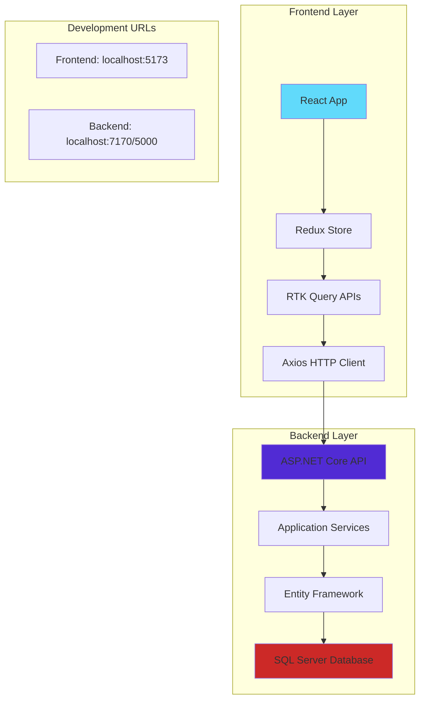
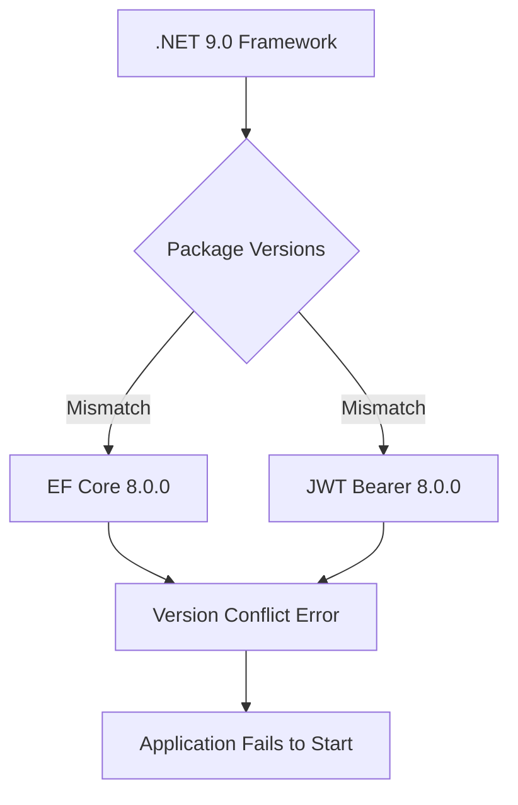
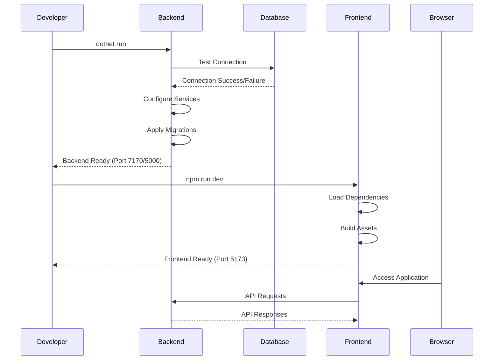
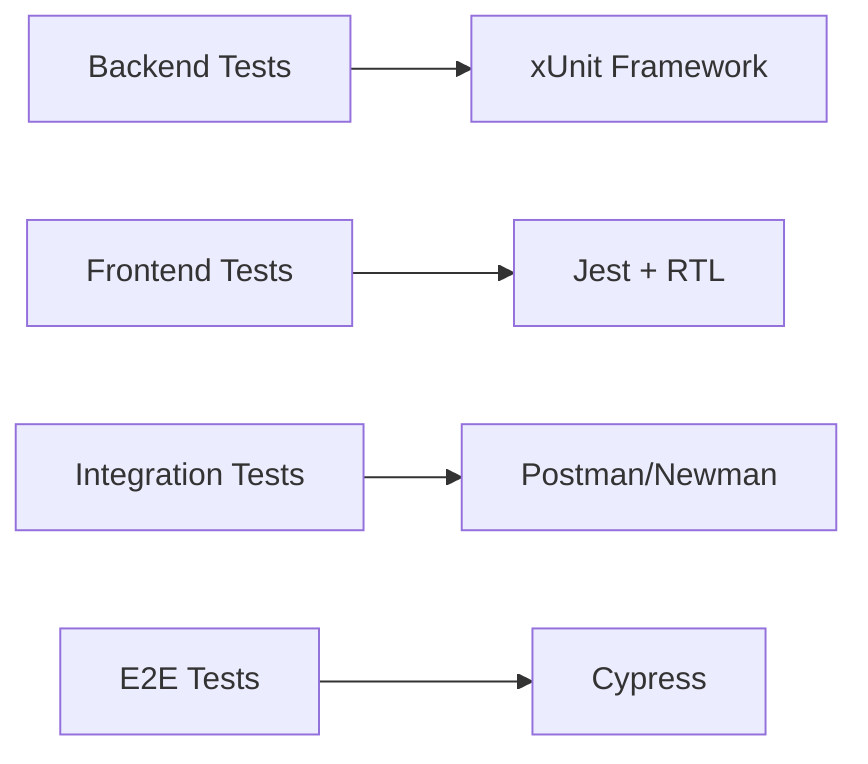
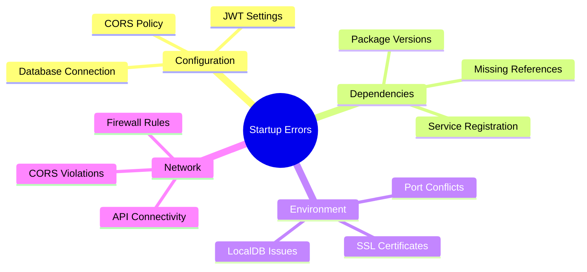

# Startup Error Fixes Design Document

## Overview

This document provides a comprehensive analysis and solution for fixing startup errors in the Portfolio Management full-stack application. The application consists of a .NET 9.0 backend with Entity Framework Core and SQL Server, and a React frontend with Vite build system.

## Architecture

The system follows a layered architecture pattern:



## Identified Startup Issues

### Backend Issues

#### 1. Package Version Compatibility


**Problem**: The backend uses .NET 9.0 but references Entity Framework Core and JWT packages version 8.0.0, creating potential compatibility issues.

**Solution**: Upgrade packages to .NET 9.0 compatible versions.

#### 2. Database Connection Issues
**Problem**: Default connection string uses LocalDB which may not be available or configured properly.

**Current Configuration**:
```json
"ConnectionStrings": {
  "DefaultConnection": "Server=(localdb)\\mssqllocaldb;Database=PortfolioManagementDb;Trusted_Connection=true;MultipleActiveResultSets=true"
}
```

#### 3. Missing Service Dependencies
**Problem**: Services referenced in Program.cs may not be properly implemented or registered.

### Frontend Issues

#### 1. Missing API Environment Variable
**Problem**: Frontend uses hardcoded API URL fallback which may not match backend port.

**Current Configuration**:
```typescript
baseUrl: import.meta.env.VITE_API_BASE_URL || 'https://localhost:7001/api/'
```

#### 2. React 19 and Redux Compatibility
**Problem**: Using React 19.1.1 with older Redux packages may cause compatibility issues.

#### 3. Missing Axios Dependency
**Problem**: The baseApi.ts file structure suggests Axios usage, but it's not in package.json dependencies.

## Startup Sequence Analysis



## Solution Implementation

### Backend Fixes

#### 1. Update Package References
Update `PortfolioManagement.Api.csproj`:

```xml
<PackageReference Include="Microsoft.AspNetCore.Authentication.JwtBearer" Version="9.0.0" />
<PackageReference Include="Microsoft.EntityFrameworkCore.SqlServer" Version="9.0.0" />
<PackageReference Include="Microsoft.EntityFrameworkCore.Tools" Version="9.0.0">
  <IncludeAssets>runtime; build; native; contentfiles; analyzers; buildtransitive</IncludeAssets>
  <PrivateAssets>all</PrivateAssets>
</PackageReference>
```

#### 2. Database Configuration Options
Provide multiple connection string options in `appsettings.json`:

```json
{
  "ConnectionStrings": {
    "DefaultConnection": "Server=(localdb)\\mssqllocaldb;Database=PortfolioManagementDb;Trusted_Connection=true;MultipleActiveResultSets=true",
    "SqlServerConnection": "Server=localhost;Database=PortfolioManagementDb;Integrated Security=true;TrustServerCertificate=true",
    "SqliteConnection": "Data Source=portfolio.db"
  }
}
```

#### 3. Enhanced Error Handling in Program.cs
Add comprehensive error handling and logging:

```csharp
// Database initialization with error handling
using (var scope = app.Services.CreateScope())
{
    try
    {
        var context = scope.ServiceProvider.GetRequiredService<PortfolioDbContext>();
        context.Database.EnsureCreated();
        app.Logger.LogInformation("Database initialized successfully");
    }
    catch (Exception ex)
    {
        app.Logger.LogError(ex, "Database initialization failed");
        // Consider fallback options or graceful degradation
    }
}
```

### Frontend Fixes

#### 1. Add Missing Dependencies
Update `package.json` to include missing dependencies:

```json
{
  "dependencies": {
    "axios": "^1.11.0",
    "lucide-react": "^0.541.0"
  }
}
```

#### 2. Environment Configuration
Create `.env.development` file:

```env
VITE_API_BASE_URL=https://localhost:7170/api/
VITE_API_TIMEOUT=10000
```

#### 3. Update Base API Configuration
Enhance error handling in `baseApi.ts`:

```typescript
const baseQuery = fetchBaseQuery({
  baseUrl: import.meta.env.VITE_API_BASE_URL || 'https://localhost:7170/api/',
  timeout: Number(import.meta.env.VITE_API_TIMEOUT) || 10000,
  prepareHeaders: (headers, { getState }) => {
    // Enhanced header configuration
  },
});
```

## Testing Strategy

### Unit Testing Framework


### Test Scenarios
1. **Database Connection Tests**
   - LocalDB availability
   - SQL Server connection
   - SQLite fallback

2. **API Endpoint Tests**
   - Authentication endpoints
   - CORS configuration
   - JWT token validation

3. **Frontend Component Tests**
   - Redux store initialization
   - API integration
   - Route protection

## Error Monitoring and Logging

### Backend Logging Configuration
```json
{
  "Logging": {
    "LogLevel": {
      "Default": "Information",
      "Microsoft.AspNetCore": "Warning",
      "Microsoft.EntityFrameworkCore": "Warning"
    }
  }
}
```

### Error Categories


## Deployment Considerations

### Development Environment Setup
1. **Prerequisites Check**
   - .NET 9.0 SDK installed
   - SQL Server LocalDB available
   - Node.js 18+ installed
   - Visual Studio Code with extensions

2. **Startup Commands**
   ```bash
   # Backend
   cd backend
   dotnet restore
   dotnet run
   
   # Frontend (new terminal)
   cd frontend
   npm install
   npm run dev
   ```

3. **Health Check Endpoints**
   - Backend: `https://localhost:7170/swagger`
   - Frontend: `http://localhost:5173`

### Production Considerations
- Use proper connection strings with credentials
- Enable HTTPS redirects
- Configure proper CORS origins
- Set up application insights
- Implement proper error boundaries

## Risk Mitigation

### High-Risk Issues
1. **Database Unavailability**
   - Implement SQLite fallback
   - Add connection retry logic
   - Provide offline mode

2. **API Connectivity**
   - Configure proper timeout values
   - Implement circuit breaker pattern
   - Add fallback UI states

3. **Authentication Failures**
   - Validate JWT configuration
   - Test token refresh mechanism
   - Implement proper error handling

### Monitoring Checklist
- [ ] Database connection status
- [ ] API response times
- [ ] Frontend bundle size
- [ ] Memory usage patterns
- [ ] Error rates and patterns